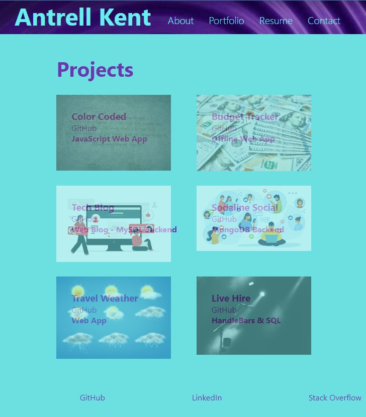

# SAPPHIRE PORTFOLIO  
  
  ## Description

  Single page web app for sharing portfolio details.  Includes a bio, focal projects, and contact details.

  Check it out at [Developer Snapshot](http://ladytrell.github.io/sapphire-portfolio)

  ## Table of Contents (Optional)

 - [Installation](#installation)
 - [Usage](#usage)
 - [Questions](#questions)
 - [License](#license)

  ## Installation

 - Clone or download the application repository 
[Sapphire Portfolio](https://github.com/ladytrell/sapphire-portfolio)
 - Download and Install node.js if not already installed.  [node.js](https://nodejs.org/en/) for your platform:  [How to Install Node.js](https://nodejs.dev/learn/how-to-install-nodejs)

  ## Usage

 - Go to the directory location where you saved the application 
 - Install dependencies
 - npm install run start
 - Type 'node index' to start the application. 
 - Answer the series of questions to provide the details for the project's readme.
 - Open dist director view access the created README.md file

  ## Demo Images
  

  ## Questions

  GitHub: [ladytrell](https://github.com/ladytrell)

  Email: [antrellkent@gmail.com](mailto:antrellkent@gmail.com)

   
  ## License

  [MIT](https://img.shields.io/badge/License-MIT-yellow.svg)
  

